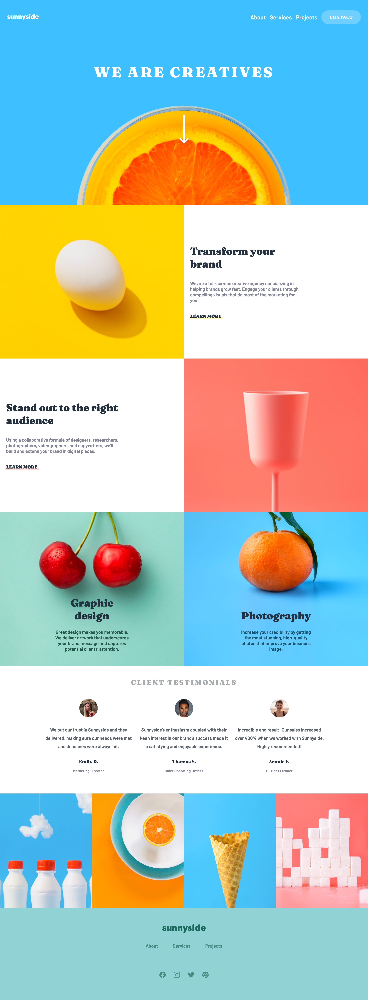
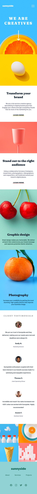

# Frontend Mentor - Sunnyside agency landing page solution

This is a solution to the [Sunnyside agency landing page challenge on Frontend Mentor](https://www.frontendmentor.io/challenges/sunnyside-agency-landing-page-7yVs3B6ef). Frontend Mentor challenges help you improve your coding skills by building realistic projects.

## Table of contents

- [Overview](#overview)
  - [The challenge](#the-challenge)
  - [Screenshot](#screenshot)
  - [Links](#links)
- [My process](#my-process)
  - [Built with](#built-with)
  - [What I learned](#what-i-learned-&-continued-development)
  - [Useful resources](#useful-resources)
- [Author](#author)

## Overview

### The challenge

Users should be able to:

- View the optimal layout for the site depending on their device's screen size
- See hover states for all interactive elements on the page

### Screenshot

### Links

- Solution URL: [Add solution URL here](https://your-solution-url.com)
- Live Site URL: [Add live site URL here](https://your-live-site-url.com)

## My process

### Built with

- Semantic HTML5 markup
- CSS custom properties
- Flexbox
- CSS Grid
- Mobile-first workflow

### What I learned & Continued development

I somehow seemed to have complicated the code for myself while writing this code. While I was doing the refactoring, I bumped into lots of tiny errors. Which were easy to solve, but nevertheless slowed me down.
I didn't do this code in onde day. Due to combining learning how to code while working a full time, I only manage to do a maximum of 1 hour/day. This also makes me loose overview of my coding. To solve this, I began writing down a to-do-list. It helped me to be focussed on my project. But I need to adapt it slightly to write cleaner.

### Useful resources

- [CSS Underline using pseudo styles](https://codepen.io/elb96/pen/aXKXBx) - An easy to read code-example on how applying the `::after`-pseudoclass to create the colored bar underneath the text.
- [Responsive Images](https://developer.mozilla.org/en-US/docs/Learn/HTML/Multimedia_and_embedding/Responsive_images)

## Author

- Website - [Katrien S.](https://www.katriens.be)
- Frontend Mentor - [@graficdoctor](https://www.frontendmentor.io/profile/yourusername)
